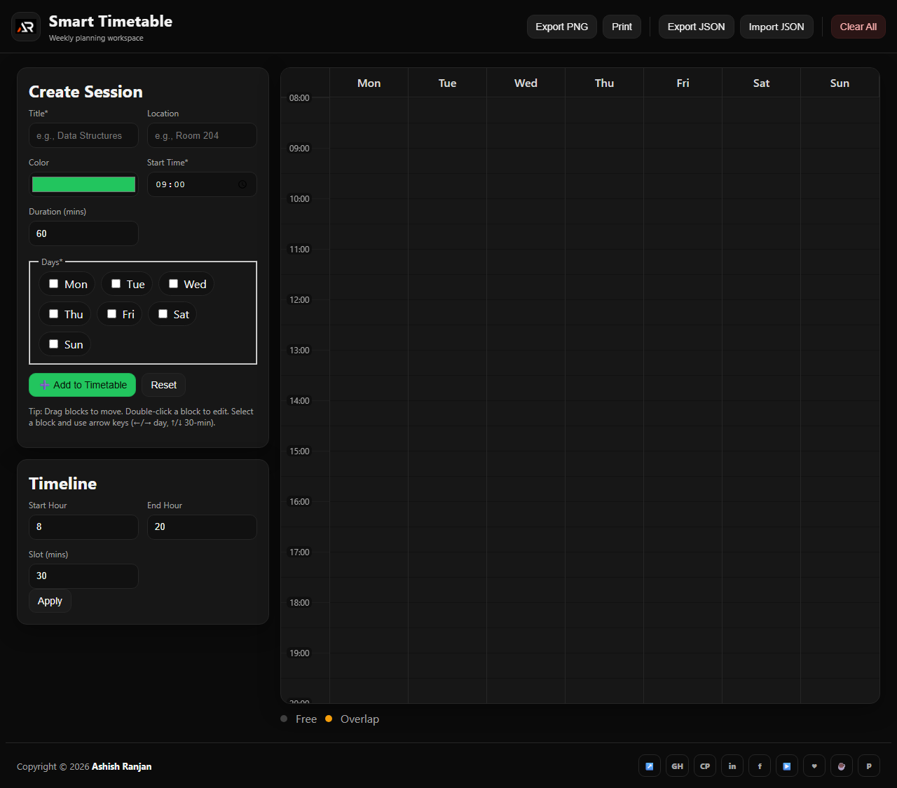

# Smart Timetable

A local-first HTML, SCSS, and JavaScript timetable builder for students and solo creators. Add sessions, move them across days, detect overlaps, and export or print a clean weekly schedule without a backend.

## Features

- Create sessions across one or more days
- Drag and drop blocks with configurable time snapping
- Double-click editing and keyboard day/time movement
- Same-day overlap detection
- Timeline start, end, and slot controls
- LocalStorage persistence with JSON import/export
- PNG export through html2canvas and print-ready layout
- Fixed branded header, icon-only footer links, and responsive layout

## Tech stack

- HTML, CSS, Sass, and vanilla JavaScript
- LocalStorage and html2canvas CDN

## Run locally

Open `index.html` in a browser or use a local static server.

## Deployment

Live app: [https://a2rp.github.io/smart-timetable/](https://a2rp.github.io/smart-timetable/)

## Links

- Portfolio: [https://www.ashishranjan.net/](https://www.ashishranjan.net/)
- GitHub: [https://github.com/a2rp](https://github.com/a2rp)
- CodePen: [https://codepen.io/ash1198](https://codepen.io/ash1198)
- LinkedIn: [https://www.linkedin.com/in/aashishranjan](https://www.linkedin.com/in/aashishranjan)
- Facebook: [https://www.facebook.com/theash.ashish/](https://www.facebook.com/theash.ashish/)
- YouTube: [https://www.youtube.com/@ashishranjan-ashz?sub_confirmation=1](https://www.youtube.com/@ashishranjan-ashz?sub_confirmation=1)
- Email: [ash.ranjan09@gmail.com](mailto:ash.ranjan09@gmail.com)

## Support

- Support: [https://a2rp-donation-page.netlify.app/](https://a2rp-donation-page.netlify.app/)
- Buy Me a Coffee: [https://buymeacoffee.com/a2rp](https://buymeacoffee.com/a2rp)
- Patreon: [https://patreon.com/a2rp](https://patreon.com/a2rp)